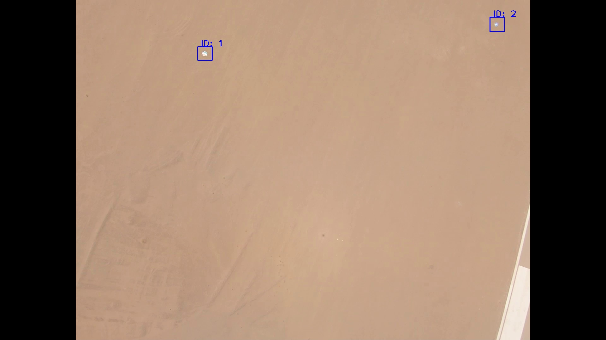
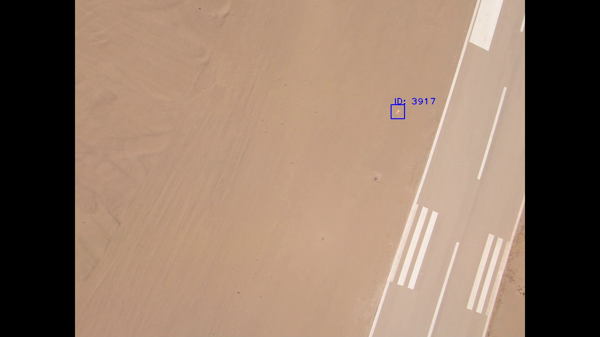

<h1 align="center">Autonomous UAV Edge-Perception System</h1>

  <em>Real-time, on-edge perception and geolocation software stack for an autonomous UAV. Engineered to run headlessly on an NVIDIA Jetson Nano during live flight, this system fuses computer vision with asynchronous MAVLink telemetry to detect ground targets and calculate their precise real-world GPS coordinates.</em>

---

<h2 align="center">System Output: Live Tracking & Geolocation</h2>

  <h3>Live Target Tracking</h3>
  
<em>System successfully tracking targets, mitigating motion blur, and maintaining temporal ID via SORT Kalman Filtering</em>

  
  

 

  <h3>Real-Time Geolocation</h3>
  
<em>Live Edge-Computation Output: The center pixel of the bounding box is mathematically projected into 3D space utilizing UAV attitude data to calculate the exact WGS84 coordinates.</em>

  
  

---

## ⚙️ System Architecture

* **Hardware:** NVIDIA Jetson Nano (Edge Compute), GoPro Hero 6, Pixhawk Flight Controller.
* **Perception (`vision.py`):** A deterministic, lightweight pipeline utilizing HLS color space conversion and dual-channel Canny edge detection. Optimized for strict SWaP-C constraints.
* **Temporal Tracking (`sort.py`):** Integrates a SORT (Simple Online and Realtime Tracking) Kalman filter to track objects across frames and mathematically eliminate false positives.
* **3D Geolocation (`geolocation.py`):** Projects 2D bounding box pixels into 3D world coordinates. Utilizes a 3-axis rotation matrix against live UAV Roll, Pitch, Yaw, and Altitude telemetry to cast a vector ray.
* **Telemetry Fusion (`telemetry.py` & `main.py`):** Asynchronously parses MAVLink data via UART. Implements a 400ms rolling telemetry buffer to compensate for camera latency, ensuring targets are fused with the exact historic UAV attitude.

## 🚀 Deployment & Testing Modes
The `main.py` orchestrator uses the `DRONE_MODE` environment variable to seamlessly switch between environments without altering the codebase:
* `LIVE`: Full headless edge-computation via UART/MAVLink.
* `VISION_ONLY`: Live camera feed with mocked telemetry for desk testing.
* `MOCK`: Full offline simulation using recorded `.mp4` and `.csv` data.

## 🛠️ Post-Flight Utility Scripts
* `flight_logger.py`: A lightweight script to securely record raw 30Hz Pixhawk telemetry to a CSV during flight.
* `post_flight_viewer.py`: An offline analysis GUI that runs the vision and geolocation pipeline against recorded flight data for debugging and validation.

## 🤝 Development Workflow
For team members contributing to this repository:
* Do not push directly to `main`.
* Branch off `dev` for new features (e.g., `git checkout -b feature/servo-integration`).
* Test all code against the `MOCK` environment using offline data before submitting a Pull Request.